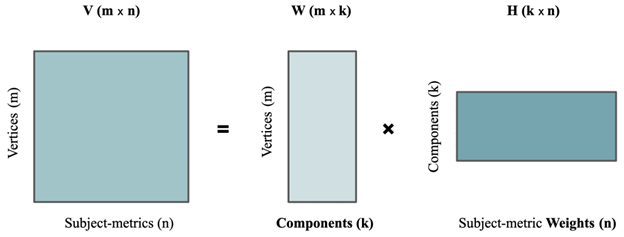
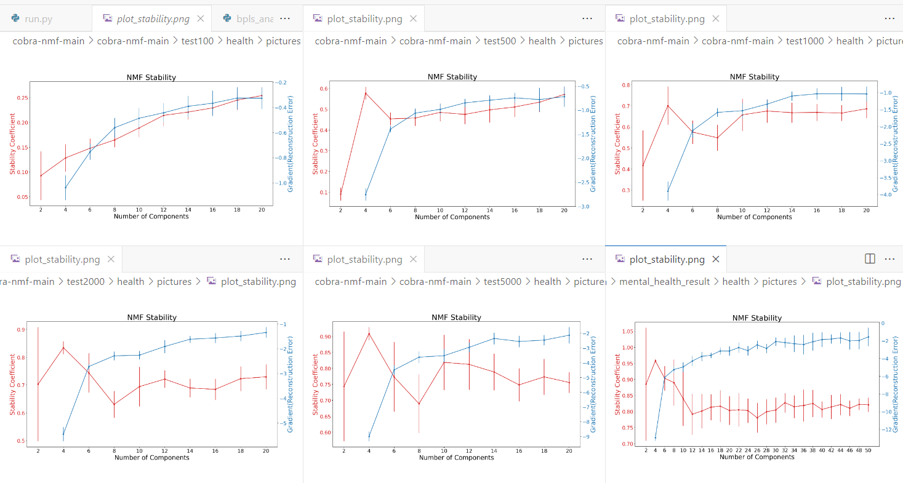
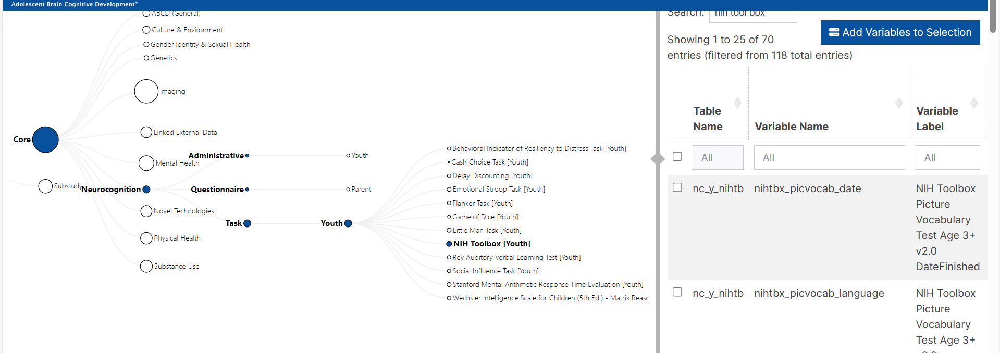

## GDLog

#### FAQ

- 为什么要用NMF？

NMF非负矩阵分解是为了降维，是一种minimum reconstruction error的方法，利用NMF把分散的vertice做了个非监督聚类，聚成k类顶点群，后面分析只需要对这k个顶点群做分析，其实就是想看这些聚集出来的脑区和人口特征做关联，关联分析方法用的是多元线性回归、PLS、和SVD

- 为什么要用OPNMF？

这里用的其实是OPNMF，这是NMF的正交投影变体，目标是提供最小重叠的分量，其中正交性确保每个顶点都能容易地分配给一个特定的分量，用于纯粹基于附加部分的表示，并提高了特异性，而投影特征确保所有分量都参与到输入数据样本的重建中，这提高了稀疏性。也就是让所有的vertices都能准确投到k上。

- 什么是偏最小二乘法，原理，本质，结果

偏最小二乘法（PLS）是一种多元统计分析方法，它通过迭代地寻找预测变量（X）和响应变量（Y）之间的最大相关性来建立模型。PLS 的基本原理如下：

1. 提取潜在变量（LVs）：首先，PLS 会将 X 和 Y 投影到一个新的空间中，并提取一组新的变量，称为潜在变量（LVs）。LVs 是 X 和 Y 之间线性组合的结果，它们能够最大程度地解释 Y 的方差。
2. 建立回归模型：接下来，PLS 会使用 LVs 作为新的自变量，对 Y 进行回归。
3. 评估模型：最后，PLS 会评估模型的性能，并根据需要进行调整。

PLS 的本质是一种 **降维** 和 **回归** 相结合的统计方法。它通过降维将高维度的预测变量转换为低维度的潜在变量，从而消除多重共线性的影响，并提高模型的预测精度。

- LVs是什么？

LVs 是潜在变量的缩写，是 PLS 模型中的关键变量。它们是 X 和 Y 之间线性组合的结果，能够最大程度地解释 Y 的方差。LVs 具有以下特点：LVs 彼此**正交**，即任意两个 LVs 之间的相关系数为 0。LVs 能够解释 Y 的方差，解释性越高，LVs 的重要性越高。LVs 能够用于预测 Y，预测性越高，LVs 的价值越高。

LVs 可以作为一种降维技术，将高维的自变量和因变量数据压缩成低维的潜在变量，并且这些潜在变量能够保留原始数据中的大部分信息。

在这篇论文里，LVs被用于分析脑部结构和功能与人口统计因素之间的关系。

**每个潜在变量 (LV) 由以下三个部分组成：**

[myHDF5 · Explore & Visualize HDF5 Files (hdfgroup.org)](https://myhdf5.hdfgroup.org/)

1. 脑评分 (brain score): 表示每个自变量对该 LVs 的贡献程度。
2. 人口统计评分 (demographic score): 表示每个因变量对该 LVs 的贡献程度。
3. 奇异值 (singular value): 表示该 LVs 解释了总体脑-人口统计关系的多少。

> **Attributes:**
>
> - 📌**x_weights (B, L)**: A NumPy array containing the weights of B features used to project the X matrix into the component space derived by PLS.
>
>   - B: Number of features in the X matrix (brain data)
>   - L: Number of latent variables extracted by PLS
>
> - 📌**y_weights (J, L)**: (Not available for PLS regression) A NumPy array containing the weights of J features used to project the Y matrix into the component space derived by PLS.
>
>   - J: Number of features in the Y matrix (demographic data)
>
> - **x_scores (S, L)**: A NumPy array containing the projection of the X matrix into the component space derived by PLS.
>
>   - S: Number of samples
>
> - **y_scores (S, L):** A NumPy array containing the projection of the Y matrix into the component space derived by PLS.
>
> - **y_loadings (J, L):** A NumPy array containing the covariance of features in Y with the projected x_scores.
>
> - **singvals (L, L):** (Not available for PLS regression) A NumPy array containing the singular values for the PLS-derived component space.
>
> - 📌**varexp (L,):** A NumPy array containing the variance explained by each of the PLS-derived components.
>
>   - explained variance (%)
>
> - 📌**permres:** An object of type `~.structures.PLSPermResults` containing the results of permutation testing, if applicable. (Used to assess the significance of LVs)
>
>   - rn_perm：10000
>   - P<0.05 (95% confidence)
>
> - 📌**bootres:** An object of type `~.structures.PLSBootResults` containing the results of bootstrap resampling, if applicable. (Used to assess variable importance)
>
>   - n_boot：10000
>
>   - P<0.01 (99% confidence) = BSR>2.58
>
>   - BSR 用来衡量变量贡献程度
>
>   - " the bootstrap ratio (BSR) was calculated as the ratio of generated singular vector weight over the  standard error of the weight from the bootstrap distribution. "
>
>   - 在偏最小二乘法（PLS）中，"singular vector weight"通常指的是`x_weights`或`y_weights`，这些权重决定了如何从原始变量（X或Y）中提取出新的变量（也就是潜在变量或成分）。
>
>     `singvals`是奇异值，它们表示的是新变量（潜在变量或成分）在描述X和Y之间关系时的重要性。如果一个奇异值大，那么对应的新变量在描述X和Y之间关系时就更重要；如果一个奇异值小，那么对应的新变量在描述X和Y之间关系时就不那么重要。
>
>     所以，"the bootstrap ratio (BSR) was calculated as the ratio of generated singular vector weight over the standard error of the weight from the bootstrap distribution"这句话在代码中的具体实现可能就是将`x_weights`（或`y_weights`）除以对应的标准误差。这个比值就是BSR，它表示的是我们对singular vector weight的估计有多确定。
>
>   - ```python
>     bsr = x_weights_normed(normalized sdterr)
>     ```
>
> - **splitres:** An object of type `~.structures.PLSSplitHalfResults` containing the results of split-half resampling, if applicable. (Used to estimate model stability)
>
> - **cvres:** An object of type `~.structures.PLSCrossValidationResults` containing the results of cross-validation testing, if applicable. (Used to assess model generalizability)
>
> - **inputs:** An object of type `~.structures.PLSInputs` containing the inputs provided to the original PLS analysis (likely the X and Y matrices and other parameters).

- 纵向数据：为什么要用线性混合模型？

线性混合模型（Linear Mixed-Effects Model，简称LME）是一种统计模型，它结合了固定效应（fixed effects）和随机效应（random effects）。这种模型特别适用于处理具有层次结构或嵌套数据的情况，比如纵向数据（longitudinal data）或分组数据（grouped data）。在这些情况下，我们不仅想估计总体的效应，还想估计个体之间的变异性。

**线性混合模型的特点**：

1. **固定效应（Fixed Effects）**：固定效应是指对所有个体或实验单位都相同的效应。在上述论文的例子中，固定效应是指年龄对所有受试者的影响，这是一个共同的效应，我们假设它对所有人都是一致的。
2. **随机效应（Random Effects）**：随机效应是指那些在不同个体或实验单位之间变化的效应。在论文的例子中，每个受试者的年龄增长斜率（即年龄对特定度量的影响）被视为随机效应，因为这种效应在不同受试者之间是不同的。
3. **层次结构或嵌套数据**：LME模型可以处理数据的层次结构，例如，多个观测值可能属于同一个受试者或组。

**线性混合模型与普通线性回归的区别**：

1. **个体变异性**：普通线性回归通常假设数据是独立的，而LME模型能够处理数据中的个体变异性，即不同受试者或组可能有不同的基线水平和/或响应模式。
2. **数据结构**：普通线性回归适用于独立数据，而LME模型适用于具有层次结构或时间序列的数据。
3. **参数估计**：在普通线性回归中，我们只估计固定效应参数。而在LME模型中，我们同时估计固定效应和随机效应参数。
4. **预测**：LME模型不仅可以用于预测总体的平均效应，还可以用于预测个体特定的效应。

**为什么使用线性混合模型**：

在论文的例子中，研究者想要分析年龄对大脑解剖结构的影响，并希望捕捉每个受试者随时间变化的特定模式。由于每个受试者可能有不同的基线水平和随时间变化的速率，因此使用LME模型可以更准确地估计这些个体特定的效应，同时控制年龄这一固定效应。

通过使用LME模型，研究者可以：

- 估计年龄对大脑结构变化的总体影响（固定效应）。
- 估计每个受试者随年龄增长的独特变化模式（随机效应）。
- 考虑到数据的层次结构，即多个观测值可能属于同一个受试者。

这种模型的应用使得研究者能够更全面地理解数据，并为每个受试者提供更个性化的分析结果。

#### 2023.11.28

看论文框架

#### 2023.12.5

获取数据集

#### 2023.12.12

用所给数据集跑通一遍代码

#### 2023.12.21

1. 确定最佳分量数k

这里，我重新交叉生成了所有的矩阵，包括meta、CT、GI、SA、MC，5个矩阵的shape均为(148, 11271)，拿`demo_brthdat_v2`即年龄进行随机对半分割，最终生成10组a、b矩阵（`n_folds`设为10）

这样也就得到10对input.mat，拿这20组数据跑 偶数k(2，20) 下的nmf，最后画图

接着拿这10对矩阵放入，看了后面的稳定性计算的代码，每个k下入有10个ouput.mat，出一个csv文件

**计算稳定性的过程：**

1. 对输入数据进行分割，创建Va和Vb矩阵。
2. 对每个分割独立执行OPNMF，得到Wa和Wb矩阵。
3. 计算Wa和Wb矩阵的余弦相似性，得到c_Wa和c_Wb。
4. 计算c_Wa和c_Wb的相关系数。
5. 计算所有行（顶点）的平均相关系数，作为稳定性的指标。

这个过程需要重复执行多次，每次改变k的值（从2到20，步长为2），即偶数K。

**相当于我要做100次的nmf计算**：

需要对每组分割的数据（10组）进行NMF计算，而且每次计算的粒度k都需要从2变化到20。这样，你就会有10（分割组数）* 10（k的变化范围）= 100次NMF计算。

这样做的目的是为了评估在不同的粒度k和不同的数据分割下，NMF的稳定性如何。通过比较不同粒度和不同分割下的结果，你可以找出哪些粒度和分割方式能够捕获到最大的数据变化模式，以及哪些粒度和分割方式的结果最稳定。

**先做5组画图，因为越到后面越耗时（只跑k4，k6都需要30min+🥲**

2. 看分解后的矩阵是什么

nmf本质就是降维，把大矩阵分解成分量矩阵、权重矩阵

现在我们的数据构成的大矩阵是(148, 46908)，即148个vertices，1w多个测试者

现在分量矩阵把1w*4压缩成k个分量，权重矩阵表示每个测试者在k个分量下的权重都是多少



3. 怎么横向分析的

#### **2023.12.26**

> 开会：拿表做人群筛选，拿超算账号，拿数据预处理

1. 跑出最优k，画曲线图
1. mat_to_brainview，跑出脑图

现在我通过这个文件生成左右半脑的txt文件listing the component scores at each vertex, and an additional column with a winner take all clustering，这两个txt文件是基于destrieux_atlas数据生成，shape是（148，3），也就是有2个components，对于每个component上都有对应到destrieux_atlas划分的148个区域上的scores，现在我要把这些score映射到脑子上，帮我编写nilearn的代码，实现这个可视化

#### 2024.1.2

1. filter出疾病人群数据做分析

> (Attention-Deficit/Hyperactivity Disorder) (Autism Spectrum Disorder)
>
> judge methed：
>
> 1. diagnoses must be current or in partial remission; not past
> 2. marked as 1 if any disorder is present; otherwise marked as 0
> 3. variable is considered missing only if all relevant diagnoses are missing

3 groups of children: adhd,  asd ,  and healthy control(健康人，作为对照)

健康人的定义是：没有任何诊断历史的  or  同时没有adhd+asd

project: 在mh_p_ksads_ss找出这3个人群的sub_id，然后和脑数据merge

#### 2024.1.9

1. 换v4数据，filter出3组人群

2. 看下怎么在这个特定数据上跑nmf
3. 数据放到平台上算平均值

#### 2024.1.18

1. 跑出了adhd的best k、brainview
2. 分析brainview、left.txt，他的这个component score本身无意义，需要做回归分析、PLS分析与info做关联才能知道意义，所以现在是在做回归分析，已经导好了数据，

|                     | adhd                                     | asd                | health             |
| ------------------- | ---------------------------------------- | ------------------ | ------------------ |
| nmf_input_shape     | 148*3216[area, sulc, thk, vol]           | 148*680            | 148*38380          |
| best_k              | 6                                        | 6                  | 6                  |
| num                 | 804                                      | 170                | 9595               |
| atlas               | dst                                      | dst                | dst                |
| W                   | 148*6[vertices, components]              | 148*6              | 148*6              |
| H                   | 6*3216[components, subejct in 4 metrics] | 6*680              | 6*38380            |
| recon               | 244.1165                                 | 111.8996           | 835.7147           |
| regression analysis | [age, sex, income]                       | [age, sex, income] | [age, sex, income] |
| n_folds             | 20                                       | 20                 | 20                 |

#### 2024.1.23

1. 跑asd的结果
2. 跑health的结果
2. 救命！突然发现k到20不够，需要更多，这样我的机子根本跑不了，得用超算。。。环境还没弄懂

#### 2024.1.30

adhd、asd两组病症实验组的稳定性和重构误差的关系随k值成异常正比，一直到k80，k=80这显然无意义

那么这个稳定性和重构误差有多重要？能妥协到多少？

#### 2024.3.6

1. 我们做一个小的验证，看是不是样本数的问题。你在health control里面随机找一个sample size和adhd/asd相近的一组，age sex match。你给这两组分别跑一次，看是不是也不稳定。
2. 选择蓝色error和红色stability差距最小的

> 在这画图：[白板文件-Pixso](https://pixso.cn/app/board/GmdmXfGQjVsfj5M4FYPAFA)

#### 2024.3.14

1. 小验证：稳定性是否与数量有关（100、500、1000、2000、5000）

有关，还和数据本身有关。

为什么论文样本数只有776效果这么好？

health组样本数从100-9595，与776相近的1000很大不同



2. 数据pls结果

bsr<2.58??? 为什么甚至上百了，bsr没算错吧。。。

#### 2024.4.13

1. 完成论文
2. 关联变量做pls分析完



3. phd是什么，为什么这个脑区跟这个语言障碍有关系

#### 2024.4.19

1. pls分析加到25个变量，看是否有多的潜变量

2. 三条路走：分量-行为认知能力；分量-分量；三组比较

3. 参考另外2篇论文综述

4. 看下bpls的论文，每个变量，整个过程是如何。。。

   [pyls: Partial Least Squares in Python — pyls 0+untagged.269.gd8a19d5.dirty documentation](https://pyls.readthedocs.io/en/latest/index.html)

偏最小二乘法(PLS)是一种统计方法，用于找出两组数据之间的关系。在这个情况下，我们关注的是行为变量（比如说，一个人的反应时间或者记忆能力）和神经活动（比如说，大脑的MRI扫描结果）之间的关系。

`behavior_pls`的过程可以分为以下几个步骤：

1. **权重计算**：首先，我们需要找出如何将神经活动数据（X）和行为数据（Y）转换为新的变量，这些新的变量可以最好地揭示两者之间的关系。这就是`x_weights`和`y_weights`的作用。
2. **得分计算**：接着，我们使用这些权重将原始数据转换为新的变量，这些新的变量被称为得分。这就是`x_scores`和`y_scores`的作用。
3. **载荷计算**：然后，我们需要找出每个新变量（得分）如何与原始的行为数据（Y）相关联。这就是`y_loadings`的作用。
4. **奇异值和解释的方差**：我们还需要知道每个新变量（得分）对揭示X和Y之间关系的重要性。这就是`singvals`和`varexp`的作用。
5. **稳定性和预测性能的评估**：最后，我们需要评估我们的模型是否稳定（即，如果我们用不同的数据集重复这个过程，结果是否一致），以及我们的模型对新数据的预测性能如何。这就是`permres`（置换测试结果）、`bootres`（自助采样结果）、`splitres`（分裂半采样结果）和`cvres`（交叉验证结果）的作用。

1. **为什么要把X和Y转换成新变量？**

这是因为在原始的X和Y数据中，可能存在很多的噪声和无关的信息，这些噪声和无关的信息会干扰我们找到X和Y之间的真正关系。通过将X和Y转换成新的变量（也就是所谓的潜在变量或者成分），我们可以将重要的、有用的信息提取出来，同时去掉噪声和无关的信息。这样，我们就可以更清楚、更准确地看到X和Y之间的关系。

2. **这些变量中我该用什么作为y对潜变量的贡献值？**

你应该使用`y_loadings`作为y对潜变量的贡献值。`y_loadings`表示的是每个潜在变量（得分）与原始的行为数据（Y）之间的关联程度。如果`y_loadings`的值大，那么说明这个潜在变量在描述Y的变化中起了很大的作用；如果`y_loadings`的值小，那么说明这个潜在变量在描述Y的变化中的作用不大。

3. **confidence interval我该怎么理解？**

置信区间是一种用来估计某个未知参数的区间。比如说，我们用样本的平均值来估计总体的平均值，但是由于样本的随机性，我们无法确定样本的平均值就是总体的平均值。因此，我们会给出一个区间，我们认为总体的平均值有很大的可能性落在这个区间内。这个区间就是置信区间。

置信区间的计算通常基于统计理论。在这个过程中，我们会假设数据满足某种分布（比如正态分布），然后根据这种分布的性质来计算置信区间。

在这个例子中，`bpls.bootres.y_loadings_ci`可能就是表示y对潜变量贡献值的置信区间。这个置信区间告诉我们，我们对y对潜变量贡献值的估计有多确定。如果这个置信区间很小，那么说明我们对y对潜变量贡献值的估计很确定；如果这个置信区间很大，那么说明我们对y对潜变量贡献值的估计不确定。

5. x, y的贡献值和显著阈值怎么确定，明确bsr和横向统计图怎么画

其实就关心三个值：bsr, ci, correlation

还差这个correlation不确定是啥，皮尔森相关系数？y_loadings?

#### 2024.5.10

- 做分类的目的是将病人分成6个亚型，因为在临床上目前还很难实现个性化诊疗，只能按照患者不同的行为医生主观判断，效果取决于医生的经验水平。那么希望从脑子上对患者做亚型分类，对每个亚型能实现统一的诊疗方法。后续工作将根据患者的分类结果做病人的亚型分类，以求能对临床上个性化诊疗做出贡献。
- 给每个人做四个特征的分类，Hweight z-score后以累加值做比较，最大值为标准。结合回归模型，比较基于脑区分成的6组他们在行为上是否表现出差异
- 三组的差异从PLS上无法直观看出，因为每组脑区分类不统一，虽然从图像上大致相同。将ADHD和ASD两组的数据按照正常人的聚类标准重新聚类，以求在统一标准上重新做PLS分析，从而能直观对比差异。怎么做逆矩阵让其他组在健康组上的标准上聚类？
- 做纵向数据

#### 2024.7.17

- 单个特征的k是多少：思路就是在split部分分割开来
- 二值化进行subgroup

#### 2024.7.24

1. area 的最佳结果可视化

2. 或许可以筛掉，减少分类组

3. 参考环境、行为的特征，整理出特征集

   > We examined a total of 41 summarized environmental exposures as done by Modabbernia, et al. (12), consisting of 5 domains (Table S2): perinatal/early development events (n = 13), life events/lifestyle (n = 7), family characteristics (n = 12), neighborhood (n = 6) and school environments (n = 3). 
   >
   > For cognitive abilities, we used scores from a well-validated **National Institute of Health Toolbox** (n = 10) at baseline and 2-year follow-up (24). 
   >
   > For mental health, we used the parent-reported Child Behavior Checklist (**CBCL**, n=11) and additional two metrics (**Prodromal Symptoms and Subsyndromal Mania**) at baseline, and 1-year follow-up (25), which were selected via balancing the sample size and information completeness (Table S3, S5, S6)

   |                      | NDA table                                                    | table                                                        |
   | -------------------- | ------------------------------------------------------------ | ------------------------------------------------------------ |
   | environment exposure | dhx01, abcd_ksad01, abcd_ysr01, abcd_yrb01, abcd_stq01, abcd_sds01, fes02, abcd_fes01, pmq01, crpbi01, pdem02, fhxp201, abcd_pnsc01, abcd_nsc01, abcd_rhds01, srpf01 | ph_p_dhx, mh_p_ksads_ss, mh_y_or, ph_y_yrb, nt_y_st, ph_p_sds, ce_p_fes, ce_y_fes, ce_y_pm, ce_y_crpbi, gish_p_gi, mh_p_fhx, ce_p_nsc,  ce_y_nsc, led_l_densbld, ce_y_srpf |
   | Cognitive ability    | abcd_tbss01                                                  | nc_y_nihtb                                                   |
   | Mental health        | abcd_pgbi01, pps01, abcd_cbcls01                             | mh_p_gbi, mh_y_pps, mh_p_cbcl                                |

4. 在area划分/4值划分后的6类人群中，对每个特征做组的统计t值比较 ---（划分标准讨论）

##### 2024.9.22

1. 解释area可视化的值，其他3个的效果如何画出来展示
2. 对比4值之和，单area划分后的人群效果如何？
3. H矩阵为什么变成单一bar了？不是有很多个脑区吗？（脑映射图是用W矩阵中最大值来代表，H矩阵本来就是6*804的聚类结果矩阵）

##### 2024.9.25

1. 一般情况要p<0.05，为了防止一型错误， 使用多重比较校正（直接拿0.05/n作为校正后的临界值）
2. 在综合特征组上，单独分析显著的变量（之前少的10个变量），每组的平均值boxplot，小提琴图，知道每组的差别（多少是显著？ttest校正是什么？ptest?)
3. 纵向，2、4年追踪 行为(有哪些用哪些）mixed（timepoint+group） linear models(random=id)
4. 纵向，148脑区变化，mlm
5. 分组减少，看下指标相不相近

q: 脑区变化是每个小区单独看吗，还是每个大区？大区又怎么group出来？
结果分析